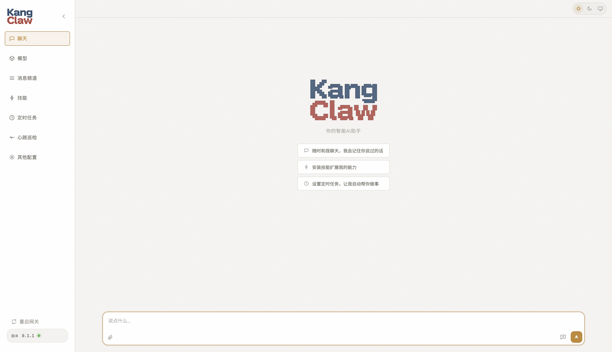
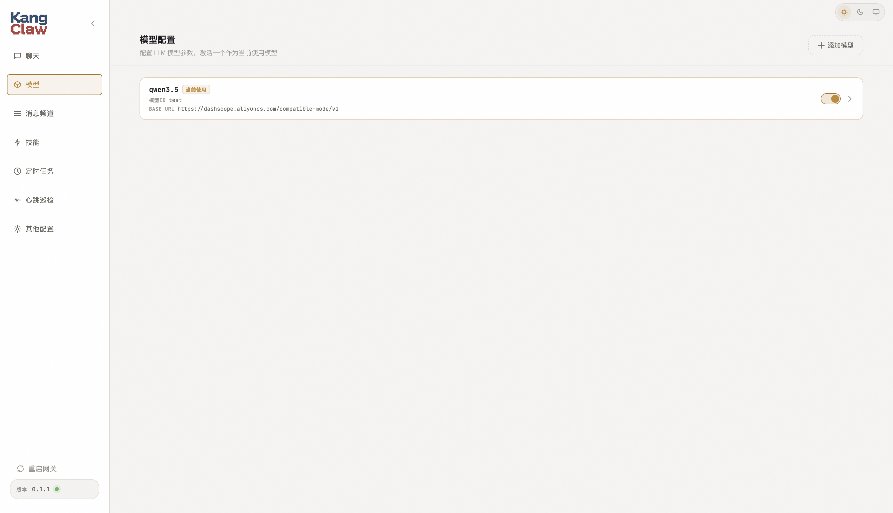
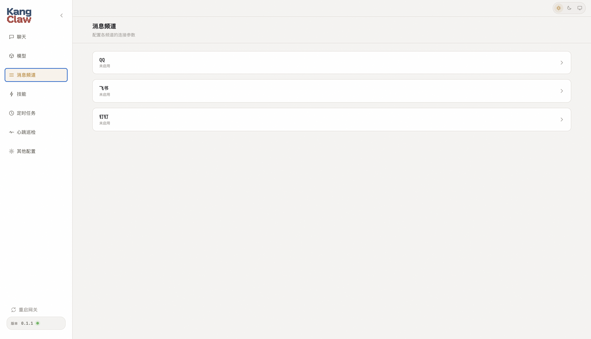
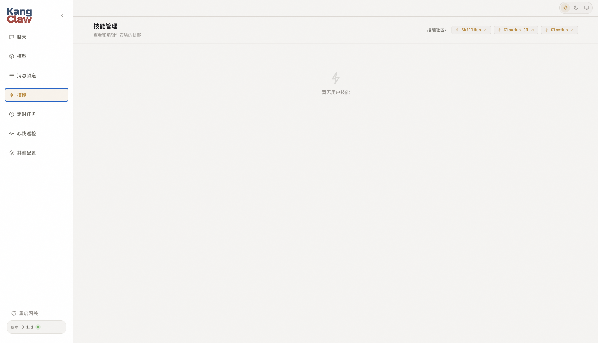
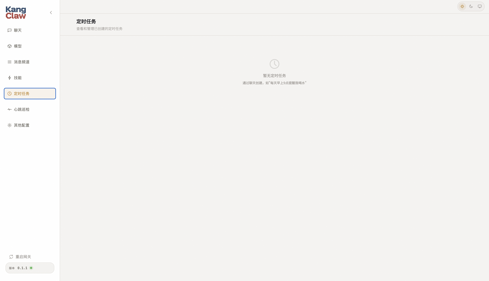
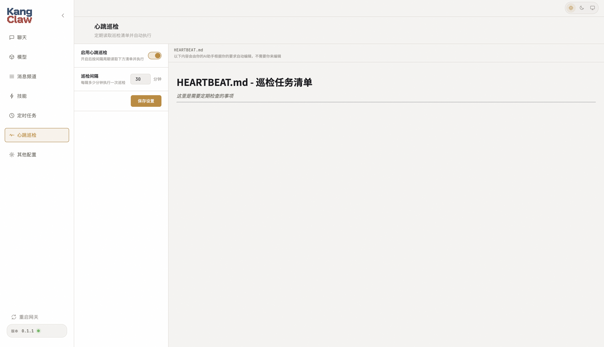
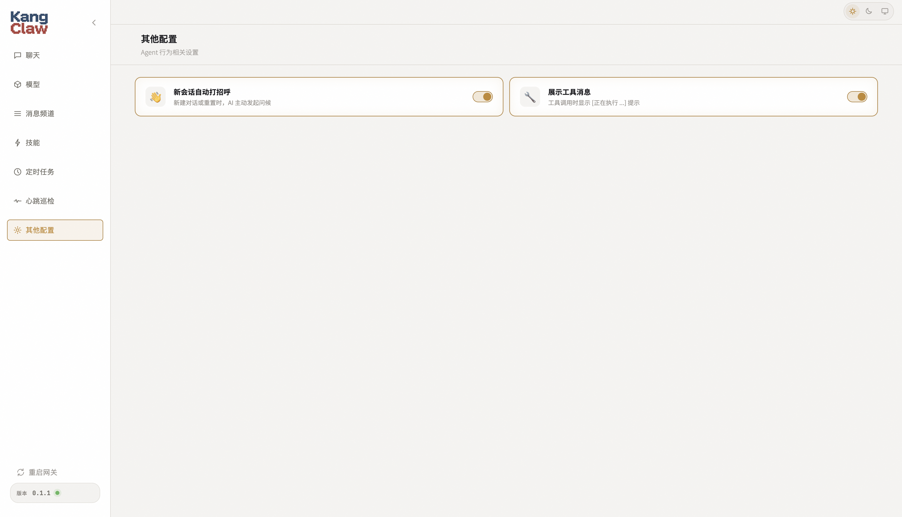

<p align="center">
  
</p>

<h1 align="center">KangClaw</h1>

<p align="center">
  <b>个人AI智能助手</b><br/>
  一个 Gateway，多端接入
</p>

<p align="center">
  
  
  
</p>

---

## 特性

- **多模型支持** — OpenAI / Anthropic / Google Gemini / DeepSeek / Ollama 等 LLM 供应商
- **多渠道接入** — 终端 CLI、Web UI、QQ 机器人、飞书机器人、钉钉机器人等
- **内置工具** — 文件读写编辑、Shell 执行、Web 搜索与抓取、定时任务等
- **智能记忆** — 短期记忆 + 长期记忆 + 历史时间线，让智能体记住更多重要信息
- **技能系统** — 通过Skills扩展智能体功能，实现更复杂的任务

## 快速开始

### 安装

```bash
# 方式一：uv
uv tool install kangclaw

# 方式二：pip
pip install kangclaw

# 方式三：从源码安装
git clone https://github.com/lvkangk/KangClaw.git
cd KangClaw
pip install -e .
```

### 初始化

```bash
kangclaw init
```

这会在 `~/.kangclaw/` 下创建配置文件和工作区：

```
~/.kangclaw/
├── config.toml          # 全局配置（模型、渠道、参数等）
└── workspace/
    ├── AGENTS.md        # 智能体行为指令
    ├── SOUL.md          # 助手人格
    ├── USER.md          # 用户画像
    ├── HEARTBEAT.md     # 心跳任务表
    ├── memory/
    │   ├── MEMORY.md    # 长期记忆
    │   └── sessions/    # 会话历史 (JSONL)
    ├── skills/          # 自定义技能
    └── cron/            # 定时任务
```

### 启动网关

```bash
# 前台启动 gateway
kangclaw gateway
```

### 打开 Web UI
```bash
kangclaw web
```
或者直接在浏览器访问 [http://127.0.0.1:12255/](http://127.0.0.1:12255/)

## Web UI 功能

打开 Web UI 后，左侧导航栏提供以下功能：

### 聊天
与 AI 助手实时对话。(需先完成模型配置)



### 模型配置
选择和配置 LLM 供应商，设置 API Key、模型名称、上下文长度等参数。



### 消息频道
配置多端接入渠道（QQ 机器人、飞书机器人、钉钉机器人），填写对应的凭证信息即可启用。



### 技能管理
查看和管理已安装的技能，扩展 AI 助手的能力。



### 定时任务
查看AI 助手创建的 Cron 定时任务。



### 心跳巡检
查看心跳任务，AI 助手会定期检查任务列表并自动执行。



### 其他配置



## CLI 命令速查表

| 命令 | 说明 |
|------|------|
| `kangclaw init` | 初始化配置和工作区 |
| `kangclaw gateway` | 启动 gateway 服务（前台） |
| `kangclaw gateway -d` | 后台启动 gateway |
| `kangclaw gateway status` | 查看 gateway 状态 |
| `kangclaw gateway stop` | 停止 gateway |
| `kangclaw gateway restart` | 重启 gateway |
| `kangclaw chat` | 终端对话客户端 |
| `kangclaw web` | 打开 Web UI |
| `kangclaw status` | 查看整体状态 |
| `kangclaw skills list` | 列出已安装技能 |
| `kangclaw cron list` | 查看定时任务 |
| `kangclaw cron remove <id>` | 删除定时任务 |


## 更新

```bash
# 方式一：uv
uv tool upgrade kangclaw

# 方式二：pip
pip install --upgrade kangclaw
```
